<!--
Hey, thanks for using the awesome-readme-template template.  
If you have any enhancements, then fork this project and create a pull request 
or just open an issue with the label "enhancement".

Don't forget to give this project a star for additional support ;)
Maybe you can mention me or this repo in the acknowledgements too
-->
<div align="center">

  <h1>Readme</h1>


<br />

<!-- Table of Contents -->
# :notebook_with_decorative_cover: Table of Contents

- [About the Project](#star2-about-the-project)
    * [Screenshots](#camera-screenshots)
    * [Tech Stack](#space_invader-tech-stack)
    * [Features](#dart-features)
    * [Color Reference](#art-color-reference)
    * [Environment Variables](#key-environment-variables)
- [Getting Started](#toolbox-getting-started)
    * [Prerequisites](#bangbang-prerequisites)
    * [Installation](#gear-installation)
    * [Running Tests](#test_tube-running-tests)
    * [Run Locally](#running-run-locally)
    * [Deployment](#triangular_flag_on_post-deployment)
- [Usage](#eyes-usage)
- [Roadmap](#compass-roadmap)
- [Contributing](#wave-contributing)
    * [Code of Conduct](#scroll-code-of-conduct)
- [FAQ](#grey_question-faq)
- [License](#warning-license)
- [Contact](#handshake-contact)
- [Acknowledgements](#gem-acknowledgements)


<!-- About the Project -->
## :star2: About the Project

<br/>* Basic Concept of view was created in Figma : https://www.figma.com/file/5TNV2aSijVHNTm0f8phW7u/Projekt-Zaliczeniowy?node-id=0%3A1
<br/>* App is still in development, right now has basic features implemented.
<br/>* Check roadmap to see an incoming changes...
<br/>* Check the features to see implemented functionalities.
<h3>Preview Login and Password is : "admin"</br></h3>
<br/>* Preview available(Login and password : admin) : https://patrykkeska.networkmanager.pl
<br/>* Frontend Repo : https://github.com/PatrykKeska/company_management_app_front
<br/>* DataBase file for Import purpose  : https://github.com/PatrykKeska/company_management_app_backend/tree/main/DataBaseScheme
<h2>Please Check Frontend repo to find out more about it :)</h2></br>

<!-- Screenshots -->
### :camera: Screenshots


  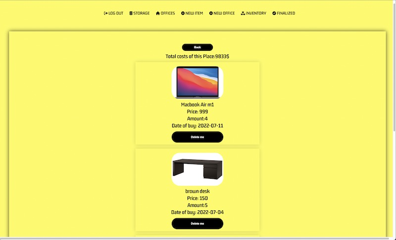
  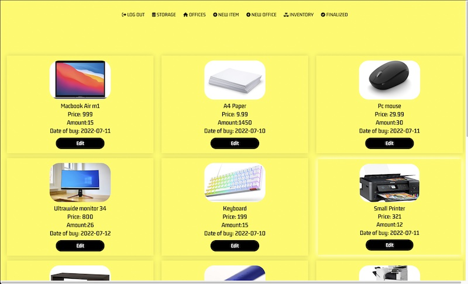
  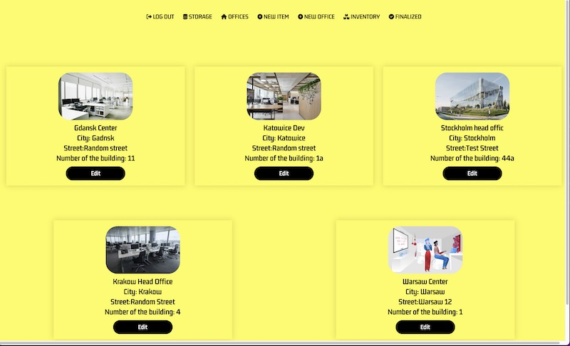
  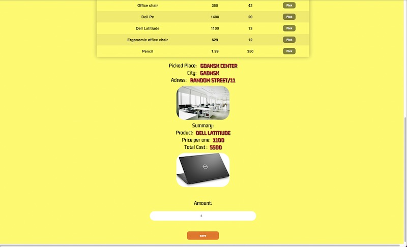
  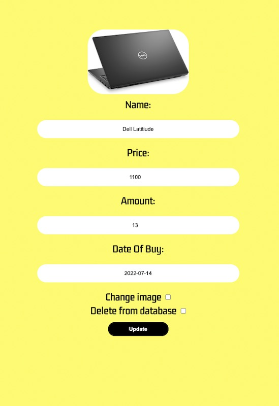
  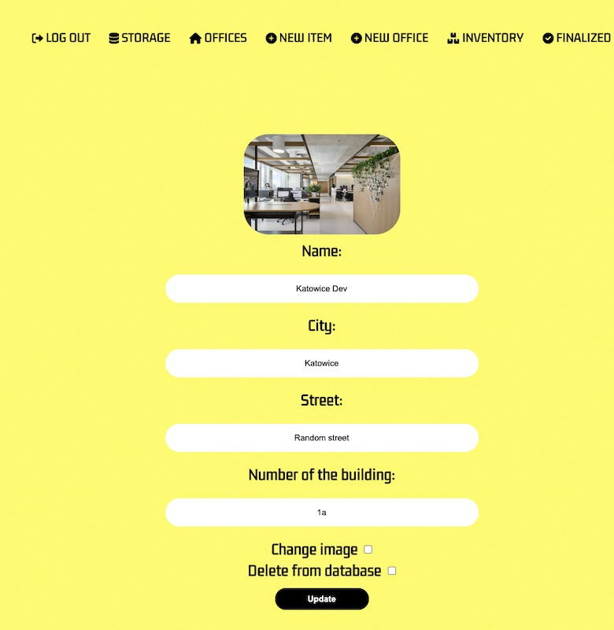
  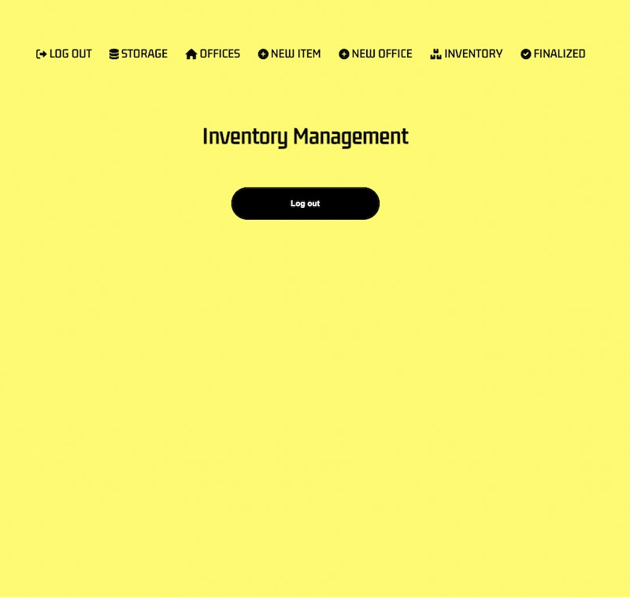
  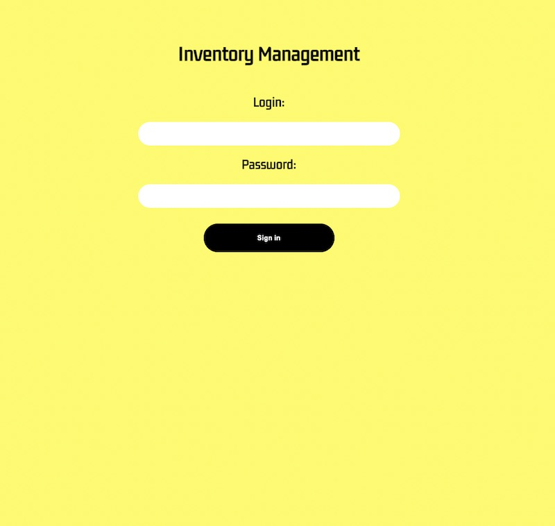

</div>

<!-- TechStack -->
### :space_invader: Tech Stack

<details>
  <summary>Client</summary>
  <ul>
    <li><a href="https://www.typescriptlang.org/">Typescript</a></li>
    <li><a href="https://reactjs.org/">React.js</a></li>
    <li><a href="https://styled-components.com/">Styled-Components</a></li>
  
  </ul>
</details>

<details>
  <summary>Server</summary>
  <ul>
    <li><a href="https://www.typescriptlang.org/">Typescript</a></li>
    <li><a href="https://expressjs.com/">Express.js</a></li>
    <li><a href="https://www.mysql.com/">MySql</a></li>

  </ul>
</details>

<details>
<summary>Database</summary>
  <ul>
    <li><a href="https://www.mysql.com/">MySQL</a></li>
  </ul>
</details>


<!-- Features -->
### :dart: Features

* [x] Login/Logout 
* [x] Local Storage Session (Possible to change session time in /utils/isTokenExpire.ts) 
* [x] RWD
* [x] Creating a new items.
* [x] Items and offices image change( For now only by pasting a link with image address) - incoming file transfer  
* [x] Editing items in storage.
* [x] Deleting items from storage. 
* [x] Assign items to  office.
* [x] Deleting items from assigned offices. 
* [x] Summary of  office.
* [x] Creating of new offices. 
* [x] Editing of existing offices. 
* [x] Deleting offices 
* [x] Keeping up to date all your resources in your offices 

Check the Roadmap to find an incoming features! 

<!-- Color Reference -->
### :art: Color Reference

| Color             | Hex                                                                |
| ----------------- | ------------------------------------------------------------------ |
| Primary Color |  |


<!-- Env Variables -->
### :key: Environment Variables
* In utils/cors.ts file please set correct path to let client side connect with API 
<div align="center"> 

  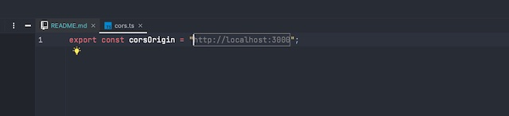

* In utils/Dbconfig and DbConnection please make sure your database variables are correct!
  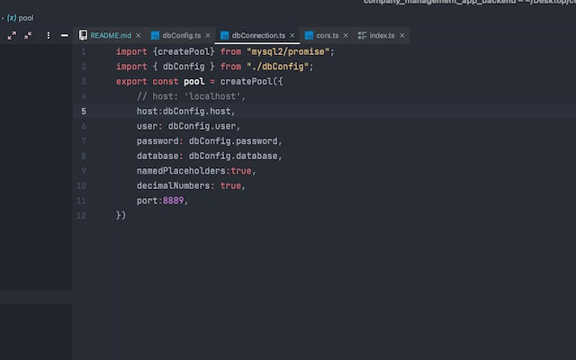
  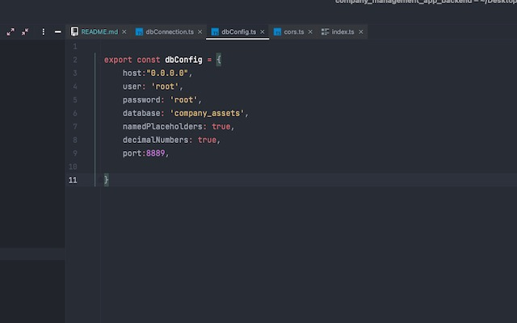


<h3>To run locally make sure backend is listening and database is implemented correctly. 


<!-- Getting Started -->
## 	:toolbox: Getting Started

<!-- Prerequisites -->
### :bangbang: Prerequisites

This project uses Yarn as package manager

```bash
 npm install --global yarn
```

<!-- Installation -->
### :gear: Installation

Install my-project with npm

```bash
  yarn install my-project
  cd my-project
```


<!-- Run Locally -->
### :running: Run Locally

Clone the project

```bash
  git clone https://github.com/PatrykKeska/company_management_app_backend.git
```

Go to the project directory

```bash
  cd company_management_app_backend
```

Install dependencies

```bash
  yarn install
```

Start the server

```bash
  yarn start:dev
```


<!-- Deployment -->
### :triangular_flag_on_post: Deployment

To deploy this project run

```bash
  yarn build
```


<!-- Usage -->
## :eyes: Usage

App can be used as your own managing tool to help you out  sort and keep up to date your company assets in local offices etc.
This is basic concept and still lot of features has to be implemented.


<!-- Roadmap  -->
## :compass: Roadmap

* [x] Basic functionality (check features section)
* [x] Linux Server Host Preview
* [ ] Registry a new accounts
* [ ] JWT session
* [ ] File transfer from Client=>Server and reverse
* [ ] Backend in NestJS


<!-- License -->
## :warning: License

Distributed under the no License. See LICENSE.txt for more information.


<!-- Contact -->
## :handshake: Contact

Patryk Keska - [@twitter_handle](https://twitter.com/Patryk09676751) - PatrykKeska4@gmail.com


